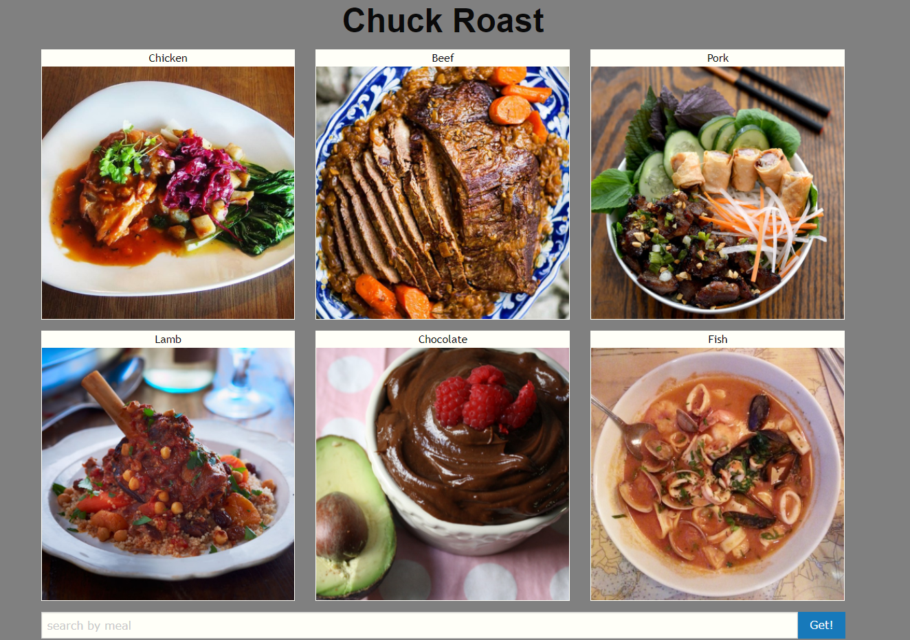

# Chuck Roast

## Description

Find a recipe based off of your ingredients at home, and get a food based Chuck Norris joke

## Usage

As a home chef, I want a recipe based off of the ingredients that I have at home. I also love Chuck Norris and would love a joke to help me get inspired to round house kick that recipe.

## Screen Shot of Page

## Third-party Assets

- [Foundation](https://get.foundation/sites/docs/installation.html)
- [TheMealDB](https://www.themealdb.com/api.php)
- [Chuck Norris database](http://www.icndb.com/api/)

## Technologies Utilized
- HTML
- CSS
- JavaScript
- jQuery

## Collaborators

- [Sam Fan](https://github.com/SamFan808)
- [Sara King](https://github.com/sarahayes20)
- [Shawn McPhee](https://github.com/scmcphee9)

## GitHub Repository URL

https://github.com/SamFan808/Chuck_Roast.git

## Live URL
